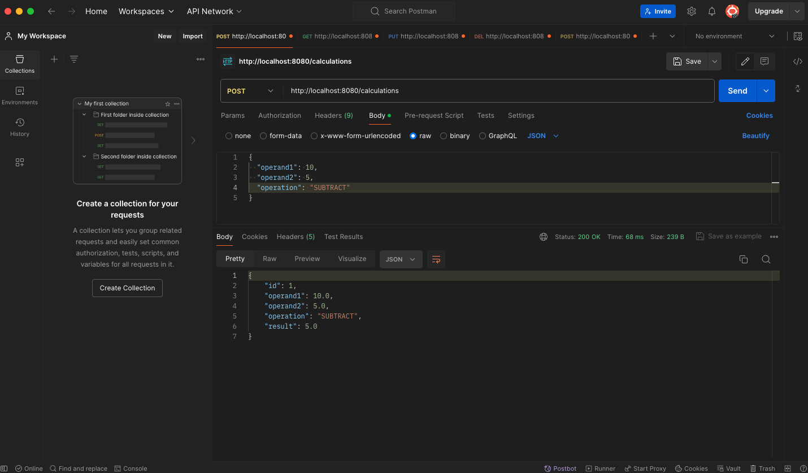

# Calculator Spring Boot Application

A simple calculator application built with Spring Boot that provides RESTful APIs for basic arithmetic operations and supports CRUD operations for calculations. The application uses an in-memory H2 database to store calculation history and demonstrates exception handling and data validation.


## Table of Contents

- [Features](#features)
- [Technologies Used](#technologies-used)
- [Getting Started](#getting-started)
    - [Prerequisites](#prerequisites)
    - [Installation](#installation)
- [Running the Application](#running-the-application)
- [API Documentation](#api-documentation)
    - [Calculator Endpoints](#calculator-endpoints)
    - [Calculation CRUD Endpoints](#calculation-crud-endpoints)
- [Testing the API](#testing-the-api)
    - [Using cURL](#using-curl)
    - [Using Postman](#using-postman)
- [Exception Handling](#exception-handling)
- [Database Configuration](#database-configuration)
- [Additional Notes](#additional-notes)
    - [Data Validation](#data-validation)
    - [Accessing H2 Console](#accessing-h2-console)
- [Screenshots](#screenshots)
- [License](#license)

---

## Features

- Perform basic arithmetic operations: addition, subtraction, multiplication, and division.
- Chain multiple operations in a single calculation.
- CRUD operations for calculations:
    - Create, Read, Update, and Delete calculations.
- Exception handling with custom exceptions.
- Data validation for input requests.
- In-memory H2 database for storing calculation history.
- RESTful APIs with clear endpoints.
- Easy to run and test with cURL or Postman.

## Technologies Used

- Java 11
- Spring Boot 2.5.x
- Spring Web
- Spring Data JPA
- H2 Database
- Maven
- JUnit 5 and Mockito for testing

## Getting Started

### Prerequisites

- **Java Development Kit (JDK) 11 or higher**: [Download JDK](https://www.oracle.com/java/technologies/javase-jdk11-downloads.html)
- **Apache Maven 3.6.x or higher**: [Download Maven](https://maven.apache.org/download.cgi)
- **Git** (optional, for cloning the repository): [Download Git](https://git-scm.com/downloads)
- **cURL** (optional, for testing the API): [Download cURL](https://curl.se/download.html)
- **Postman** (optional, for testing the API): [Download Postman](https://www.postman.com/downloads/)

### Installation

1. **Clone the Repository**

   ```bash
   git clone https://github.com/YourUsername/Calculator.git
   ```

2. **Navigate to the Project Directory**

   ```bash
   cd Calculator
   ```

3. **Build the Project with Maven**

   ```bash
   mvn clean install
   ```

   This command compiles the code, runs tests, and packages the application into a JAR file.

---

## Running the Application

You can run the application using Maven or by running the generated JAR file.

### Option 1: Using Maven

```bash
mvn spring-boot:run
```

### Option 2: Running the JAR File

After building the project, run the JAR file located in the `target` directory:

```bash
java -jar target/calculator-1.0.0.jar
```

The application will start on **`http://localhost:8080`**.

---

## API Documentation

### Calculator Endpoints

#### 1. Perform a Calculation

- **Endpoint:** `/calculator/calculate`
- **Method:** `GET`
- **Description:** Performs a basic arithmetic operation between two numbers.
- **Query Parameters:**
    - `operation` (required): The operation to perform (`ADD`, `SUBTRACT`, `MULTIPLY`, `DIVIDE`).
    - `num1` (required): The first operand (number).
    - `num2` (required): The second operand (number).
- **Example Request:**

  ```
  GET http://localhost:8080/calculator/calculate?operation=ADD&num1=10&num2=5
  ```

- **Example Response:**

  ```json
  15.0
  ```

#### 2. Chain Multiple Operations

- **Endpoint:** `/calculator/chain`
- **Method:** `POST`
- **Description:** Performs a sequence of operations starting from an initial value.
- **Request Body:**

  ```json
  {
    "initial_value": 5,
    "operations": [
      {
        "operation": "ADD",
        "operand": 3
      },
      {
        "operation": "MULTIPLY",
        "operand": 2
      }
    ]
  }
  ```

- **Example Response:**

  ```json
  16.0
  ```

### Calculation CRUD Endpoints

#### 1. Create a Calculation

- **Endpoint:** `/calculations`
- **Method:** `POST`
- **Description:** Creates a new calculation and stores it in the database.
- **Request Body:**

  ```json
  {
    "operand1": 10,
    "operand2": 5,
    "operation": "SUBTRACT"
  }
  ```

- **Example Response:**

  ```json
  {
    "id": 1,
    "operand1": 10.0,
    "operand2": 5.0,
    "operation": "SUBTRACT",
    "result": 5.0
  }
  ```

#### 2. Get All Calculations

- **Endpoint:** `/calculations`
- **Method:** `GET`
- **Description:** Retrieves all calculations stored in the database.
- **Example Response:**

  ```json
  [
    {
      "id": 1,
      "operand1": 10.0,
      "operand2": 5.0,
      "operation": "SUBTRACT",
      "result": 5.0
    }
  ]
  ```

#### 3. Get Calculation by ID

- **Endpoint:** `/calculations/{id}`
- **Method:** `GET`
- **Description:** Retrieves a specific calculation by its ID.
- **Example Request:**

  ```
  GET http://localhost:8080/calculations/1
  ```

- **Example Response:**

  ```json
  {
    "id": 1,
    "operand1": 10.0,
    "operand2": 5.0,
    "operation": "SUBTRACT",
    "result": 5.0
  }
  ```

#### 4. Update a Calculation

- **Endpoint:** `/calculations/{id}`
- **Method:** `PUT`
- **Description:** Updates an existing calculation.
- **Request Body:**

  ```json
  {
    "operand1": 20,
    "operand2": 4,
    "operation": "DIVIDE"
  }
  ```

- **Example Response:**

  ```json
  {
    "id": 1,
    "operand1": 20.0,
    "operand2": 4.0,
    "operation": "DIVIDE",
    "result": 5.0
  }
  ```

#### 5. Delete a Calculation

- **Endpoint:** `/calculations/{id}`
- **Method:** `DELETE`
- **Description:** Deletes a calculation by its ID.
- **Example Request:**

  ```
  DELETE http://localhost:8080/calculations/1
  ```

- **Example Response:**

    - **Status Code:** `204 No Content`

---

## Testing the API

You can test the API using **cURL** commands or with **Postman**.

### Using cURL

#### 1. Perform a Calculation

```bash
curl -X GET "http://localhost:8080/calculator/calculate?operation=ADD&num1=10&num2=5"
```

#### 2. Chain Multiple Operations

```bash
curl -X POST -H "Content-Type: application/json" -d '{
    "initial_value": 5,
    "operations": [
        {"operation": "ADD", "operand": 3},
        {"operation": "MULTIPLY", "operand": 2}
    ]
}' "http://localhost:8080/calculator/chain"
```

#### 3. Create a New Calculation

```bash
curl -X POST -H "Content-Type: application/json" -d '{
    "operand1": 10,
    "operand2": 5,
    "operation": "SUBTRACT"
}' "http://localhost:8080/calculations"
```

#### 4. Get All Calculations

```bash
curl -X GET "http://localhost:8080/calculations"
```

#### 5. Get Calculation by ID

```bash
curl -X GET "http://localhost:8080/calculations/1"
```

#### 6. Update a Calculation

```bash
curl -X PUT -H "Content-Type: application/json" -d '{
    "operand1": 20,
    "operand2": 4,
    "operation": "DIVIDE"
}' "http://localhost:8080/calculations/1"
```

#### 7. Delete a Calculation

```bash
curl -X DELETE "http://localhost:8080/calculations/1"
```

### Using Postman

1. **Install Postman** from [https://www.postman.com/downloads/](https://www.postman.com/downloads/).

2. **Create a New Request** and set the method and URL.

3. **Set Headers**:

    - `Content-Type: application/json`

4. **Set the Request Body** for POST and PUT requests.

5. **Send the Request** and observe the response.


s
---

## Exception Handling

The application includes custom exception handling to provide meaningful error messages.

- **Division by Zero:**

    - **Exception:** `ArithmeticException`
    - **Response:**

      ```json
      {
        "message": "Cannot divide by zero.",
        "details": "Attempted to divide 10.0 by zero."
      }
      ```

- **Calculation Not Found:**

    - **Exception:** `CalculationNotFoundException`
    - **Response:**

      ```json
      {
        "message": "Calculation not found with ID: 99"
      }
      ```

- **Invalid Input Data:**

    - **Exception:** `MethodArgumentNotValidException`
    - **Response:**

      ```json
      {
        "message": "Validation failed",
        "details": "Operand1 cannot be null"
      }
      ```

---

## Database Configuration

- The application uses an **in-memory H2 database**.
- **Data Persistence:**

    - Data is stored in memory and will be lost when the application stops.
    - For persistent storage, configure a different database like MySQL or PostgreSQL.

- **H2 Console:**

    - Access the H2 console at `http://localhost:8080/h2-console`.
    - **JDBC URL:** `jdbc:h2:mem:calculatordb`
    - **User:** `sa`
    - **Password:** *(leave blank)*

---

## Additional Notes

### Data Validation

- The application uses **Java Bean Validation** to validate input data.
- **Validation Annotations:**

    - `@NotNull`: Ensures that the field is not null.
    - `@Min`: Ensures that the field has a minimum value.

- **Example:**

  ```java
  public class CalculationRequest {

      @NotNull(message = "Operand1 cannot be null")
      private Double operand1;

      @NotNull(message = "Operand2 cannot be null")
      private Double operand2;

      @NotNull(message = "Operation cannot be null")
      private Operation operation;

      // Getters and setters
  }
  ```

### Accessing H2 Console

- **Enable H2 Console:**

  In `src/main/resources/application.properties`:

  ```properties
  spring.h2.console.enabled=true
  spring.h2.console.path=/h2-console
  spring.datasource.url=jdbc:h2:mem:calculatordb
  spring.datasource.driverClassName=org.h2.Driver
  spring.datasource.username=sa
  spring.datasource.password=
  spring.jpa.database-platform=org.hibernate.dialect.H2Dialect
  spring.jpa.show-sql=true
  spring.jpa.hibernate.ddl-auto=update
  ```

- **Access the Console:**

  Open `http://localhost:8080/h2-console` in your browser.

- **Configure Connection:**

    - **Driver Class:** `org.h2.Driver`
    - **JDBC URL:** `jdbc:h2:mem:calculatordb`
    - **User Name:** `sa`
    - **Password:** *(leave blank)*

- **Execute Queries:**

  You can view and manipulate the data using SQL queries.

  ```sql
  SELECT * FROM CALCULATION;
  ```

---

## Screenshots

### Postman Request Example


---

## License

This project is licensed under the MIT License - see the [LICENSE](LICENSE) file for details.

---

**Note:** If you encounter any issues or have questions, feel free to create an issue or contact the maintainer.

---

**Happy Calculating!**